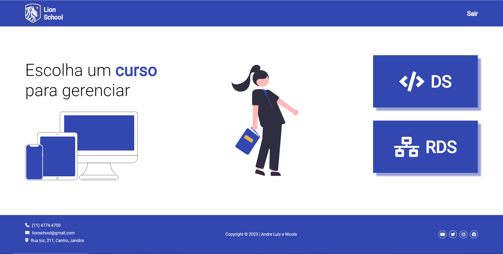
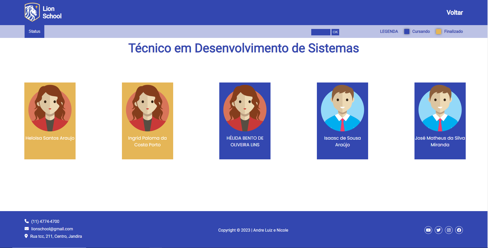
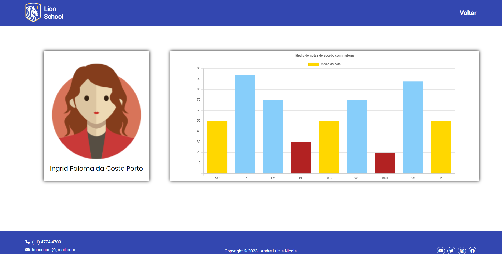

# lion-school

## Sobre o Projeto

 

O Projeto Lion School foi criado com a proposta de integralizar os conhecimentos adquiridos nas aulas de PWFE (Programação Web Front End) e PWBE (Programação Web Back End), seu intuito era montar uma aplicação desktop com responsividade com base em características de design no figma, fornecer e exibir dados dos alunos da instituição, até o momento temos três telas:

 

 

A primeira tela é uma home simples que carrega dinamicamente os únicos cursos que até então a escola oferta.

 

Clicando neles temos a página seguinte que exibe todos os alunos do curso escolhido, tanto os que estão cursando quanto os que finalizaram.

É possível fazer a filtragem dos alunos de duas formas, através do menu dropdown que fornece as opções de exibição de alunos que estão cursando ou que finalizaram e também a filtragem por ano pelo input.

 

Após escolher um aluno podemos ver seus dados na última pagina, ela exibe especificamente seu nome, foto e um gráfico contendo suas notas conforme as matérias cursadas feito com a biblioteca Chart.js. A cor de cada barra varia com base em suas notas.

 

## Tecnologias utilizadas

- Javascript
- HTML
- CSS
- Node.js
- Chart.js
- Figma

 

## Deploy

### Deploy Back-End (API)

Realizado com o [Cyclic](https://www.cyclic.sh/)

### Deploy Front-End

Realizado com o [Vercel](https://vercel.com/)

 

## Repositorios

### Confira também os repositorios:

[Back-End](https://github.com/AndreLuisConstantino/BackEnd_Project-Lion-School)

[Front-End](https://github.com/nicanico/lion-school) - Você está aqui 🚩

[Repositorio Geral](https://github.com/AndreLuisConstantino/Project-Lion-School) - versão descontinuada

 

## Colaboradores

|                                                                                                             |                                                                                                                                                              |
| ----------------------------------------------------------------------------------------------------------- | ------------------------------------------------------------------------------------------------------------------------------------------------------------ |
|  |  |
|              |              |
